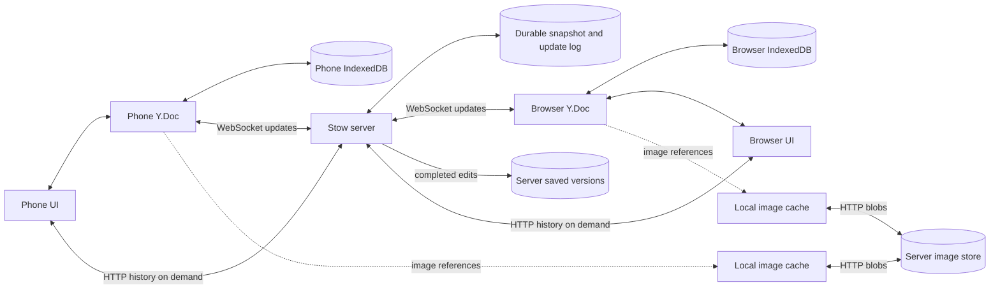

# Stow architecture

Stow is a personal notes vault that happens to synchronize. Opening a note, typing, checking an item, searching, and archiving operate against the device's local data. The server keeps a durable current copy, moves changes between devices, and owns saved version history. Editing does not wait for a round trip.

The browser uses React and TypeScript, one Yjs document per personal vault, IndexedDB for local persistence, a WebSocket connection for synchronization, and separate immutable image blobs. The Rust server uses Axum, Tokio, and Yrs to exchange compatible Yjs updates.

## Supported browser environment

Stow requires a current browser in a secure context: HTTPS for access from other devices, or HTTP localhost during development. TLS can terminate at nginx while the Stow server continues speaking HTTP. The app checks this requirement before loading the vault or connecting sync. It uses the browser's native UUID generation, SHA-256 implementation, and Web Locks for ownership of unfinished edits; unsupported environments fail before opening account storage.

Compatibility paths require a concrete product requirement and their own tests. Deployment configuration should satisfy the supported environment. Offline queues and reconnect retries are part of the data model's intended behavior, and storage failures remain visible.

## One vault document

Live, archived, and trashed notes stay in one document per account. Archiving changes a field and requires no transfer protocol.

A single `Y.Doc` keeps startup, persistence, sync, and operations involving multiple notes straightforward. It contains normalized shared maps; it does not contain a JSON string representing the entire application. Text and checklist items remain independently editable.

Each device loads the current vault CRDT into memory. Saved versions stay on the server. Item and attachment indexes, cached note views, incremental current-text search, and windowed cards avoid repeatedly rebuilding or mounting the entire collection. Independent historical snapshots are fetched only when requested. The server stores incremental updates between periodic snapshots. Initial loading and current-state memory remain costs to measure on large collections and phones.

The overview derives shortest-column placement from the saved note sequence, with leftmost ties, separately for each visible group. It does not write layout coordinates to the vault. Only nearby cards mount; unseen cards initially use a 210px height estimate. ResizeObserver readings are applied together once per frame, using measurements only at their original card width. A visible card anchors the scroll offset across measurement changes. Reserved image-gallery geometry and selection borders that do not change size avoid unnecessary repacking. Height adoption pauses during pointer dragging, then resumes on release; structural group or width changes cancel the gesture. Keyboard neighbors are found from card rectangles rather than sequence offsets.

## Data model

| Data | Representation | Why |
| --- | --- | --- |
| Notes | A map keyed by stable note IDs, containing shared fields | Changing a color need not replace the note's text. |
| Card placement | One scalar `{ pinned, sortOrderDate }` on each source note | A pin or drag resolves as one placement; sorting never changes source identity. |
| Titles and bodies | Original `Y.Text` fields, with ordered references for combined text | Concurrent insertions and deletions retain their original identities through merges. |
| Checklist items | An `items` map keyed by ID, with `noteId`, `text: Y.Text`, `checked`, optional `parentId`, and `rank` | Checking one item does not replace the list or another item's text. |
| Checklist ordering | Rank within siblings plus stable ID as a tie-breaker | A parent moves its whole group through its own position; children retain their identities and parent references. |
| Merge relationships | Edges between existing note IDs plus an ordered text recipe | A merge preserves source identities while exposing one ordinary note. |
| Joining text | Independently editable `Y.Text` runs | Separators do not compete with offline appends to an original title or body. |
| Image attachments | Metadata and content-hash references | Binary image bytes stay outside text synchronization and history. |
| Saved versions (outside Yjs) | Server-owned, independent snapshots in per-account history files | Phones fetch only the requested timeline page and preview. |

Scalar fields still require a policy when two devices change the same value concurrently. Yjs supplies a deterministic result; that is not a guarantee that it represents the user's preferred intent. Text edits use text operations, and item edits address stable IDs, to avoid unnecessary collisions.

Replacing an entire note or checklist with ordinary JSON would lose those fine-grained semantics. Moving a nested shared object by deleting it and reinserting it is also unsuitable: an integrated Yjs shared type cannot be integrated a second time. Normalized records and rank fields avoid that problem. [Yjs shared types and caveats](https://docs.yjs.dev/getting-started/working-with-shared-types)

Card sort dates start at creation time. Existing sources without a placement field read their stored pin status and creation time without writing a migration. Cards sort by descending sort date, with creation time and stable ID breaking ties. Pinning and unpinning set the date to the current time, advanced just beyond the destination group's leading date if necessary to guarantee first position despite equal or skewed clocks. Ordinary text and checkbox edits do not affect order.

A drag changes the date to the midpoint of its full-group neighbors; filtered views use this same underlying order. Pinned/unpinned and live/archive/trash groups stay separate. At an end, the date is placed beyond the adjacent card. Equal dates or exhausted floating-point gaps cause the authored move to spread the smallest sufficient surrounding window into available numeric space. Those adjustments share the move's undo transaction and leave content-edit timestamps alone. This is a numeric ordering policy, with no background renumbering or server ordering service.

Concurrent drags can choose the same date and then resolve by the stable tie-breaker. Concurrent moves or pin changes on one source converge to one complete placement through Yjs's map conflict rule, not necessarily the action with the later wall-clock timestamp. A precision repair writes the observed neighbors' placements too and can compete with concurrent placement changes to those neighbors. A merge writes the first selected note's color and complete placement to the oldest source, which remains the stable representative. It preserves the selected sort date rather than performing a pin-to-top action. Order changes never rewrite `createdAt`, the source IDs, or the merge relationships.

Checklist groups have one child level. Existing items with no parent reference remain roots without any migration writes. An authored move writes the destination parent and sibling rank together. Group membership is resolved within the whole logical note, including items from different original sources. Parent movement preserves child references, so a concurrently added child follows its parent after synchronization. Parent checkbox actions apply to the children observed by the author; a late unchecked child remains visible because only completely checked groups enter the completed section. Deleting a parent promotes its observed children; it does not delete their text.

Concurrent parent changes can produce a chain or cycle even when each local edit respects one level. A shared read-only projection follows live same-component parent references to the root, flattens descendants into one child level, and elects the smallest item ID as the root of a cycle. Missing, deleted, self, or references outside the logical note display as roots. This rule converges without background repair writes and never hides a live item. History stores the raw references, uses the same projection for display, and remaps item and parent IDs across the whole checklist when restoring a copy.

An explicit move or deletion of a visible child also reattaches its observed raw dependents to the old group root, preserving the visible siblings. This is part of the authored transaction: moving one child after an offline conflict must not unexpectedly move another visible sibling with it. A parent move continues to carry the whole group.

## Local edits and synchronization

The diagram below describes one user's vault. Each user has an independent instance of this storage and synchronization path.

1. A UI action changes the local `Y.Doc`, and the view updates immediately.
2. The local IndexedDB adapter batches same-turn document updates and the unfinished edit timestamps in one transaction and reports pending writes until it commits. Failed writes remain queued and produce a visible error. Every 500 records, compaction reads all stored updates into a temporary Y.Doc and replaces the log with its encoded state in the same write transaction. This collects eligible obsolete payloads while preserving CRDT identities and another tab's writes. Persistence is asynchronous, so an in-memory change and a completed local write are distinct events.
3. While connected, the client sends batched changes to the server. The server serializes persistence and acknowledges an update after its update file (or initial snapshot) and directory have been synced to disk.
4. Other connected devices receive changes and apply them to their own documents.
5. After reconnecting, peers exchange state and missing updates. Retrying an already-received update is safe.

Yjs updates are commutative, associative, and idempotent: applying the same set in a different order or applying an update twice converges to the same result. State vectors summarize which changes a peer has, allowing synchronization to exchange missing differences. The network connection carries these updates; the CRDT supplies convergence. [Yjs document updates](https://docs.yjs.dev/api/document-updates)

SSE plus HTTP uploads would also be possible. SSE itself only carries server-to-client events, whereas the chosen WebSocket connection carries both directions and acknowledgments together. Neither transport alone provides offline persistence or conflict resolution. [MDN: server-sent events](https://developer.mozilla.org/en-US/docs/Web/API/Server-sent_events/Using_server-sent_events)

Connection state, local persistence, and server durability are different facts. The protocol's update acknowledgment is specifically a server persistence acknowledgment. It does not promise that a different device has received the update, that every image has uploaded, or that a backup has completed.

## Merging notes without losing late edits

A naive merge copies two notes into one and deletes the originals. That fails when an offline phone later uploads an edit to an original note: the text that was copied could never have contained that unseen edit. Making copy-and-delete a single CRDT transaction does not solve the problem.

Stow records relationships between the original note IDs. Connected notes form one component whose stable representative is chosen by oldest `createdAt`, then note ID. The public `Note` has one title, body, checklist, and attachment list. Original source snapshots are internal provenance for text identity and history; the UI does not expose separate sections or a special merged-note kind.

An authored text recipe records selection order and references the original `Y.Text` fields. The first selected title remains the title; the other titles become lines at the beginning of the body, followed by the selected bodies. Joining newlines are their own editable text runs. Body edits apply one text splice across all intersected runs, including edits that delete an old boundary. Empty runs remain addressable by late offline edits. Joining characters are not appended to original fields: doing that would let a concurrent suffix insertion land after a separator and interrupt the original phrase.

Checklist items and attachments retain their original IDs and ownership. A merge assigns the observed checklist roots one order, preserving child relationships. Moves and indentation then work across original ownership boundaries. If a phone edits or adds an item in B while offline, that item appears in the combined checklist when it reconnects. The text writer similarly continues editing the original text objects, without a second transfer or replay protocol.

Concurrent merges also converge: A–B on one device and B–C on another produce one A/B/C component. Each merge authors connections across every source it observes, including sources joined by earlier merges. Recipes sort by authored generation and stable ID, retain each original field once, and include content from overlapping branches. Concurrently chosen orders have a deterministic result, which need not match both authors' preferred order; retaining both branches' joining text can add extra separators. Cycles are harmless because the view computes connected components rather than following a potentially cyclic redirect chain. Creation timestamps choose the stable component ID; they do not choose the visible title.

Undo reverses the local merge's relationships, recipe, and checklist changes. If another device's merge still connects the sources, they remain connected. The small joining text allocations retain their identities even after the creating merge is undone, so another device's later recipe can still reference them; edits to those runs participate in ordinary Undo/Redo. There is no separate unmerge command. Old separation records remain readable in history.

Existing graph-only merges derive their previously displayed source order without writes. Their first authored text edit materializes the editable recipe; the first checklist structural edit materializes shared ranks. These transitions are part of the corresponding undoable action. History records raw sources, recipes, and referenced joining text, while preview, editor, search, and export share the flat materializer.

See [storage integration](storage-protocol.md) for the worker lifecycle, binary sync contract, and validation of the combined implementation.

## Immediate undo and server history

Current data, browser-local Undo, and saved versions have separate lifetimes. Every text input changes `Y.Text`, enters local IndexedDB, and synchronizes immediately. A local `Y.UndoManager` retains fine steps: 500 ms idle, two seconds continuous input, cursor movement, target changes, or insertion/deletion direction changes split typing. Paste, cut, and IME composition remain whole operations. Remote changes and timestamp bookkeeping do not enter the local Undo stack. Undo/Redo is visible in the open note, including on touch screens. Opening a note adds one browser history entry: Back closes it, Forward reopens it, and the editor's Close consumes the same entry.

A coarse edit ends after five seconds idle, field blur, closing the note, browser-window blur, document hiding, or pagehide. A distinct action ends pending typing too. Completion publishes the last actual input time in current metadata; net-zero edits do not publish a new modification time. Pending composition delays completion until its final input. Completion stops subsequent Undo capture without combining earlier fine steps. Current modification times do not depend on retained saved versions.

IndexedDB schema 2 has `updates`, `pendingEdits`, `maintenance`, and `undo` stores. A dedicated worker commits current updates, pending timestamps, and Undo/Redo metadata atomically. Compaction retains deleted content needed by saved Undo entries. `maintenance` records the validated update-log tail, avoiding repeated deletion compaction on unchanged reloads. `pendingEdits` contains only source IDs and pending modification timestamps. Account-scoped Web Locks prevent recovery of another active tab's timestamps or Undo stack. Recovery publishes timestamps without replaying historical snapshots, then resumes an inactive local Undo stack. Permanent deletion prunes affected Undo and recovery entries. Failed writes remain visible and retryable. Version 1 current-only caches gain the Undo store without losing offline edits; older historical cache schemas remain incompatible. See [browser persistence](storage-protocol.md#browser-persistence) for restart and multi-tab semantics.

After durable acknowledgment of current updates, an online client sends a small `history-boundary` hint containing source IDs, edit time, and optional action context. The server's serialized vault queue captures the current source-aware state it actually observes, derives descriptions from that state, and stores an independent snapshot. Hints are not persisted or retried as an offline outbox. The initial server response identifies the current-only schema before the client applies any data; older servers are rejected. After initial synchronization, `sync-complete` asks the server to capture changed sources from the reconnect. Several offline intermediate states or racing boundaries may therefore produce only one saved version. This is intentional. Live edits still merge normally.

Saved versions live in the account's `history/` directory, in atomically replaced bundles indexed by source sets. They are not Yjs objects, do not create CRDT history tombstones, and are never included in WebSocket document updates or browser persistence. Each version has its own complete source state; deleting an older version cannot invalidate a later preview. Source identities let merged notes find earlier versions and permit redaction when one source is permanently deleted. Relevant label settings accompany snapshots; global color/deletion events remain nonrestorable settings entries.

`GET /api/history?noteId=…` returns a paginated timeline; `GET /api/history/:id` fetches a preview. Both use the same verified account and vault binding as image APIs. The UI orders versions by server recording time and distinguishes an older client edit time when needed. It shows an explicit offline state, missing-version errors, and known history failures. It does not promise every authored action or device's path. Restore copy creates ordinary current notes from an independent snapshot. Historical search remains deferred.

History compression defaults on and can be disabled in Storage and history. When enabled, note history over 100 records is reduced to the newest 50 plus 25 older endpoints, preserving the first endpoint. Earlier adjacent intervals are combined by temporal proximity, retaining actual later snapshots. Endpoint consolidation applies in Notes, Archive, and Trash. Complete archive cleanup is independently optional: seven days archived and unchanged, checked every four hours, or a confirmed manual discard. Cleanup removes saved-version files and their historical image references. It does not touch current Yjs identities, local Undo, or unfinished-edit recovery. A late device sends current edits, not obsolete historical records; those edits can create a new observed version after cleanup. See [archive cleanup](archive-history-cleanup.md).

Current-update acknowledgments report current-data durability. A history capture failure is reported separately and cannot turn an acknowledged note edit into a sync failure. Server history files, cleanup metadata, and current vault files must all be included in backups. The online JSON vault export includes history; offline current-note export explicitly excludes it and binary attachments.

## Images, links, and offline startup

Image files are immutable blobs addressed by a hash of their bytes. The note stores attachment metadata and the hash. The server derives versioned WebP thumbnails, up to 512 pixels per side, and caches them beside each vault's originals. The client eagerly caches thumbnails referenced by current notes. Images needed by local Undo remain protected separately. It fetches a full original only when the user opens it, with a 50 MiB per-account least-recently-viewed cache for uploaded originals. Thumbnails remain separate from that budget. Pending local uploads retain their original bytes until the server confirms storage, even if they exceed the budget.

Local additions create their thumbnail immediately. A same-account image database schema upgrade generates missing thumbnails from already cached originals before making those originals eligible for eviction. It does not read shared databases or other accounts. Bounded queues limit decoding and requests, foreground originals take priority, and object URL leases are revoked when no longer displayed. Uploaded original bytes can be evicted from IndexedDB while an existing display lease remains valid. Progress exposes pending uploads and thumbnails; storage, decoding, and download errors remain visible.

An uncached original requires connectivity. Cached thumbnails and originals work offline, but an image that has never reached a device cannot be available there. Original downloads are checked against their content hashes; thumbnail downloads are checked against the server's digest header. Every request and cache remains bound to the verified account.

Keeping blobs separate prevents each image from inflating CRDT updates or being recopied into every note revision. It also permits upload retries without generating another logical attachment. Links remain part of the note's text and are usable locally; opening their destination depends on the destination's availability.

A service worker caches the production application shell so the app can start offline. IndexedDB persists the notes independently of that shell. The first visit and initial synchronization require a connection. Service workers require HTTPS, with a localhost exception for development. A phone visiting an ordinary HTTP LAN address does not get that exception. [Yjs offline persistence](https://docs.yjs.dev/getting-started/allowing-offline-editing), [MDN: service workers](https://developer.mozilla.org/en-US/docs/Web/API/Service_Worker_API)

Browser storage is not an unconditional permanent disk. It has quotas and can be evicted; persistent storage requests are subject to browser policy. Clearing site data removes local copies, including edits that have not reached the server. The server copy and backups remain necessary. [MDN: storage persistence and eviction](https://developer.mozilla.org/en-US/docs/Web/API/Storage_API/Storage_quotas_and_eviction_criteria)

Synchronization runs while the app is active and reconnects when it is opened again. Mobile operating systems can suspend a closed or backgrounded PWA. This version does not promise continuous background sync, push notifications, or scheduled reminders.

The server keeps a durable set of source owners for each uploaded or referenced image. Removing an attachment or discarding saved history does not retire that ownership: a current browser's Undo may still need the original. Bytes become collectible after all owner sources are permanently deleted and no surviving current, history, or pending-upload reference remains. Unknown-owner files are not swept. This deliberately spends server disk to avoid a distributed Undo-lease protocol; the phone's original-image cache remains bounded.

## The server's job

The server serves the built application, authenticates access to each personal vault, exchanges CRDT updates, persists vaults, stores original images, and generates thumbnails. Note editing, merge interpretation, current search, and history preview rendering run on clients; version capture and retention run on the server. Authentication is access control; this version does not implement end-to-end encryption or encryption of the data directory.

Each open vault has an accepted Yrs document and a private validation document. An incoming update is first applied to the validation document, then durably stored, then applied to the accepted document and broadcast. Failed validation or writes reset the private document to the accepted state. Healthy edits do not clone the entire vault; this trades a second in-memory server replica for incremental validation and isolation of rejected updates. Requests, queued operations, and WebSocket connections hold leases on their account's cached vault. Unused vaults become eligible for eviction after 30 seconds; active leases keep the same documents alive through publication.

Storage consists of `vault.yjs` plus ordered immutable files under `updates/`. Files are written through an exclusive temporary file, synced, renamed, and directory-synced before acknowledgment. Before the next append when the log reaches 500 files or 4 MiB, the accepted state is atomically written as a snapshot and included log files are removed. A crash between snapshot publication and cleanup leaves duplicate updates that replay idempotently. Unpublished temporary files are ignored; corrupt published records fail vault loading visibly. Compaction preserves the Yjs identities required by offline devices. Backups must include both the snapshot and the update directory.

## User identity and vault isolation

Proxy mode accepts exactly one `X-Auth-User` identity and verifies a private `X-Stow-Proxy-Secret` on each API request and WebSocket handshake. nginx must overwrite these headers using authenticated state and its configured secret. The socket's loopback address is insufficient evidence of proxy authentication: the Vite dev server also forwards arbitrary LAN requests over loopback. Password mode is a separate explicit configuration for one personal vault; a failed proxy identity never enters it.

The server derives opaque, stable vault IDs from the identity and persistent server secret. Every vault has its own Yjs state, snapshot, update log, blob and thumbnail directories, serialized write queue, and WebSocket peers. An update only broadcasts within that vault. Blob and thumbnail requests include the caller's expected `X-Stow-Vault`, and WebSocket URLs include `vaultId`; the server compares these to the authenticated identity before opening data. This catches an account change between the client's session request and a subsequent upload.

Each vault directory also contains a private `account.json` with `user`, `authMode`, and `vaultId`, so an operator can identify its owner. Proxy accounts record the verified proxy username; the single password account records the logical user `owner`. This file is descriptive: authentication and directory selection still use the server secret and account-incarnation registry. It contains no passwords, cookies, or proxy secrets. Include it in backups.

New proxy vaults receive this record when first opened for an authenticated request; password mode records its single logical owner at startup. For an existing directory, a compatible authenticated session check can add the record without loading its notes, including when the stored vault format is unsupported. Sessions do not create new vault directories, and maintenance never guesses an unknown owner. Matching records are left untouched; malformed or conflicting records cause an explicit error instead of being overwritten. Explicit account resets preserve the old record in the backup and write the replacement vault ID into the new directory. Maintenance errors name both the directory and the recorded owner, or say `owner unknown` when no verified record is available.

The browser resolves `/api/session` before opening account storage. Note and image databases, cross-tab update channels, object URLs, and undo history belong to one account for the lifetime of the page. A verified account change blocks the old page, closes its connection, and preserves its pending edits before offering a reload. Session rechecks and cross-tab account notifications cover tabs whose WebSocket was already open. Requests remain bound to their original vault throughout asynchronous uploads.

Offline startup may reopen the last verified account when the session request cannot reach the server. An explicit authentication rejection or malformed response cannot activate this path. Reconnection verifies the account before sending edits or images. This provides account separation for synchronization, not encryption against someone who controls the browser profile or disk.

Account storage has no cross-account or shared-vault migration path. The server opens only the authenticated account's vault, and the browser opens only that account's note and image databases. Old shared files, shared browser caches, and other accounts' data are never copied into the active vault. Already populated private vaults retain their data, while new users start empty. Password mode refuses a data directory containing user vaults, preventing it from reopening an old shared snapshot.

Run one server process for a data directory. A multi-process deployment would need coordinated writes and update distribution. Keep durable storage on a persistent volume, and back up the complete directory with the service stopped so the vault and referenced blobs form a consistent copy. See the [deployment and backup instructions](../README.md).

## Native server durability

Each authenticated account owns one vault and one mutex. Sync writes, history maintenance, upload reservations, thumbnail publication, and broadcasts hold that account's guard. Disk operations run on Tokio's blocking pool. Each socket processes one incoming operation at a time and has a bounded outgoing queue; a slow peer reconnects and synchronizes from its retained state.

An incoming update first changes a private validation replica. Only successful validation and durable file publication produce a `DurableUpdate`. Broadcasts require that value; the transfer handler emits `done` only after the account operation returns successfully. Rejected updates reset the private replica. Healthy updates retain both native document identities and append small log records. The HTTP and WebSocket handlers cannot construct a committed update from arbitrary bytes.

Snapshot publication precedes log removal. Cleanup intent is journaled before document publication, and blob deletion additionally checks the committed document's authorization and remaining owners. Failed writes can conservatively delay retention cleanup but cannot shorten its grace period.

Yrs is pinned to 0.26.0 for the browser's Yjs 13 protocol and the pinned stable Rust toolchain. Documents explicitly use UTF-16 offsets. Snapshot and sync encoders include unresolved updates waiting for missing dependencies. JSON numbers are normalized at the CRDT boundary: JavaScript's `2` and Yrs's decoded `2.0` must select the same history schema and compare as the same value.

The current document contains no saved versions or history generations. The server rejects legacy history roots, including roots containing only deleted keys. Independent JSON bundles hold endpoint snapshots, action patches, and label settings. The in-memory history index and paginated timeline responses retain summaries without snapshot state or action payloads; a selected preview reads its full bundle. History failures remain separate from current-write durability.

Compression defaults on and retains 50 recent endpoints and 25 older intervals, including the first endpoint, once history exceeds 100 versions. An identical-state retry still retries failed compression. Thinning or deleting one source redacts mixed snapshots while preserving unselected sources. Complete archive-history discard is separately optional, with server-observed grace and a durable discard journal. Removed images keep durable source ownership for local Undo until every owner is permanently deleted.

The browser and server independently implement source-aware deletion and history projection. Interoperability tests compare native results before browser guards run, including Unicode patches and descriptions, so browser cleanup cannot conceal a server omission. Account incarnation resets use the same Rust library through an explicit offline administrative command.

See [browser persistence and sync protocol](storage-protocol.md) for the IndexedDB stores and wire format, and [performance tools](performance.md) for repeatable synthetic trials.
